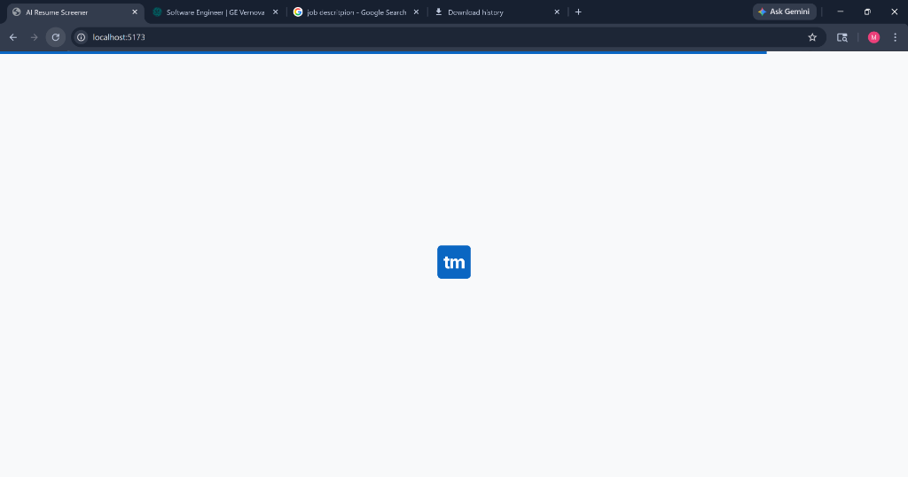
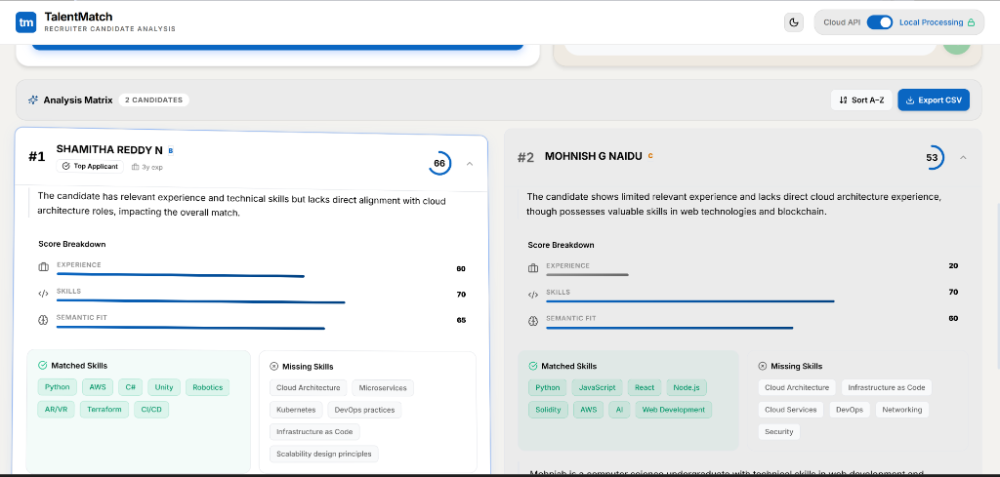
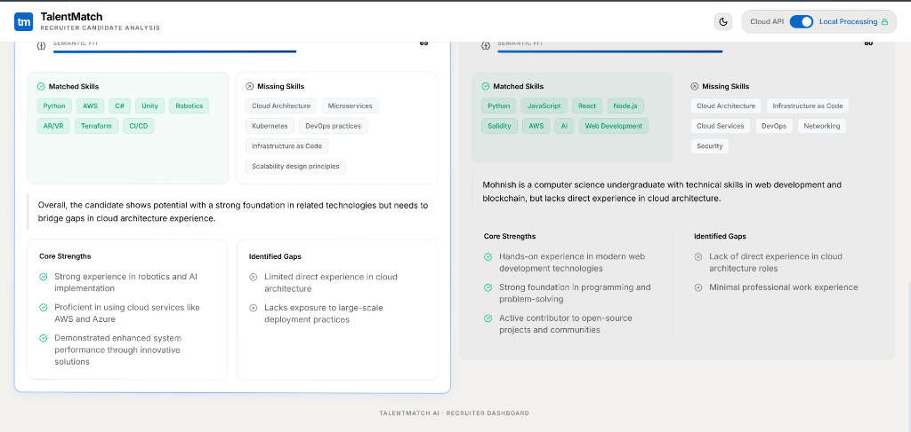
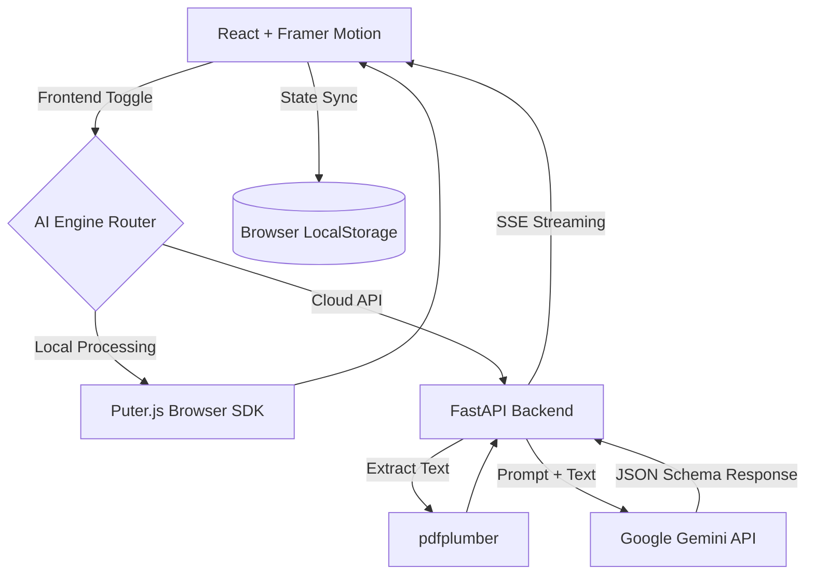

# 🚀 TalentMatch AI: The Future of Candidate Screening

Hey there! 👋 Welcome to **TalentMatch AI**. 

I built this project because manually reading through hundreds of resumes for a single job posting is exhausting. I wanted to create something that felt **fast, secure, and incredibly premium**—a tool that a modern recruiting team would actually *enjoy* using. 

TalentMatch evaluates multiple PDF resumes against a job description in seconds. It combines a highly polished, LinkedIn-inspired enterprise UI with a state-of-the-art dual-engine AI architecture. 

You can upload resumes, view an auto-ranked candidate matrix, and use a real-time WhatsApp-style AI chat interface to ask complex contextual questions about the candidate pool.

---

### 🌟 See it in Action

Here is a quick look at how the application works!

#### 1. Cinematic Boot Sequence
We wanted the app to feel premium the second you open it. It starts with a custom-built, cinematic loading sequence with a sleek progress bar.


#### 2. The Recruiter Dashboard & WhatsApp-Hybrid Chat
Upload your resumes on the left, type in a job description, and hit "Analyze Candidates". On the right side, you'll see our custom AI chat. We designed it to feel exactly like WhatsApp—complete with speech bubble tails, Inbox/Outbox styling, and bouncing "..." typing animations while the AI thinks!


#### 3. The Candidate Analysis Matrix
Once the AI finishes screening, the dashboard fluidly auto-scrolls down to reveal the Leaderboard. Candidates are ranked by an intelligent Match Score. You can instantly see their core strengths, identified gaps, and exact skill matches!


---

## ✨ Premium UI/UX & Features

- **Cinematic Startup Sequence**: A highly polished, multi-step boot loader featuring a sleek progress bar and corporate branding.
- **Ambient Floating Mesh Background**: A beautiful, continuous Framer Motion background featuring drifting glowing orbs that expand and contract, seamlessly shifting colors when toggling Light/Dark themes.
- **Fluid Bento-Grid Layout**: Interactive drag-and-drop upload zone and a candidate leaderboard that automatically and fluidly animates when re-sorting by Name or Match Score.
- **WhatsApp-Hybrid Chat**: A premium streaming chat interface featuring authentic speech bubble "tails", dynamic Outbox/Inbox styling, and a bouncing "..." typing indicator while the AI processes logic.
- **Human-Readable CSV Exports**: With one click, export a beautifully formatted CSV report that lists "Top Strengths to Note", "Areas for Improvement", and "Overall Fit Score" so you can easily share results with hiring managers.
- **Dark / Light Mode**: Beautiful, persistent themes powered by custom CSS variables tailored for maximum readability and visual contrast.

## 🧠 Dual-Engine AI Architecture (Puter vs. Gemini)

We believe you should have ultimate control over how AI processes your sensitive candidate data. That's why you can toggle the AI Engine directly from the top-right corner of the dashboard:

1. **Local Processing (Puter.js)**: 
   - **How it works:** Processes the PDF text and runs inference entirely within the browser ecosystem using the `puter.js` SDK.
   - **Why use it:** Maximum privacy (data doesn't bounce around external cloud servers), fast response times, and requires zero API key setup. Highly recommended for sensitive internal recruiting.
2. **Cloud API (Google Gemini)**: 
   - **How it works:** Transmits the extracted resume text to the robust Python (FastAPI) backend, which interfaces directly with Google's Gemini-2.0-Flash model.
   - **Why use it:** Leverages heavier compute and complex prompt-engineering capabilities. Best for extremely dense technical resumes or massive candidate pools. Features built-in LLM caching and exponential backoff retry logic.

## 🏗️ Architecture Stack



## 🚀 Local Development Setup

### 1. Backend Setup (FastAPI)
```bash
cd backend
python -m venv venv
# On Windows: venv\Scripts\activate
# On Mac/Linux: source venv/bin/activate
pip install -r requirements.txt
cp .env.example .env   # Add your Google Gemini API key
uvicorn main:app --reload
```

### 2. Frontend Setup (React/Vite)
```bash
cd frontend
npm install
cp .env.example .env   # Ensure VITE_API_URL is set to your backend (default http://localhost:8000)
npm run dev
```

## 🌍 Deployment Guide (Free Hosting)

This application is fully optimized for free hosting tiers. Configuration files (`render.yaml`, `vercel.json`) are already included.

### Backend — Render.com
1. Push this repository to GitHub.
2. Go to [Render.com](https://dashboard.render.com/) → **New Web Service**.
3. Render automatically detects the `render.yaml` blueprint. If not, use:
   - Root Dir: `backend` | Build: `pip install -r requirements.txt` | Start: `uvicorn main:app --host 0.0.0.0 --port $PORT`
4. Add your `GEMINI_API_KEY` in the Environment tab and deploy.

### Frontend — Vercel
1. Go to [Vercel.com](https://vercel.com/) and import your repository.
2. Select the `frontend/` folder as the Root Directory.
3. Add `VITE_API_URL` to the Environment Variables pointing to your Render backend (e.g., `https://resume-screener-backend.onrender.com`).
4. Deploy. (The included `vercel.json` ensures SPA routes work perfectly).

## ⚠️ Known Limitations
- The Cloud API backend cache is in-memory only and clears upon server restart.
- PDF Text extraction (`pdfplumber`) does not utilize OCR; scanned image-only PDFs will fail extraction.
