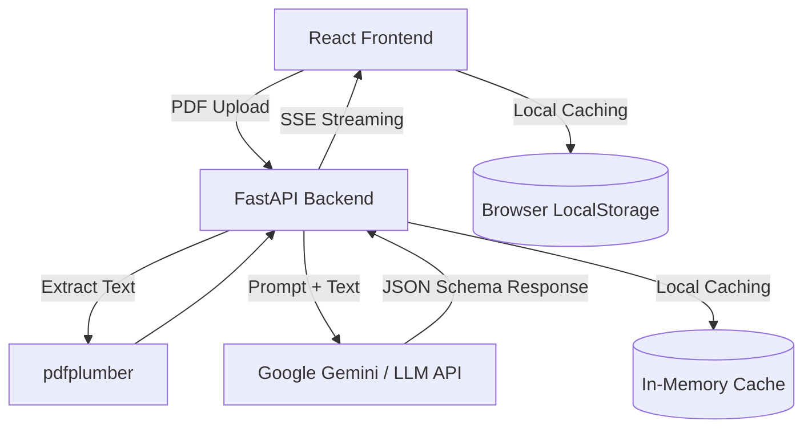

# AI Resume Screener

AI Resume Screener is a full-stack internal hiring tool that evaluates multiple PDF resumes against a job description using Gemini. The backend parses and scores resumes, while the frontend presents ranked results and a recruiter chat experience with live streamed responses. The app is designed for quick recruiter workflows and straightforward cloud deployment.

## Features

- Upload and screen multiple PDF resumes in one request
- AI-powered candidate ranking with score, strengths, gaps, and summary
- In-memory MD5-based resume result caching to avoid duplicate LLM calls
- Interactive leaderboard with score/name sorting and CSV export
- Dark mode with persisted preference
- Real-time recruiter chat using SSE streaming responses from FastAPI

## Architecture



## Backend Setup

```bash
cd backend
python -m venv venv
source venv/bin/activate
pip install -r requirements.txt
cp .env.example .env   # add your Gemini key
uvicorn main:app --reload
```

## Frontend Setup

```bash
cd frontend
npm install
cp .env.example .env
npm run dev
```

## Deployment (Free Hosting Guide)

This application is fully optimized for free hosting tiers. I have included configuration files to make this process seamless.

### Backend (FastAPI) — Render.com
Render is perfect for hosting Python backends. The free tier offers 512MB RAM and spins down after 15 min of inactivity (which is perfectly acceptable for demos).

1. Push this repository to GitHub.
2. Go to [Render.com](https://dashboard.render.com/) → **New** → **Web Service**.
3. Connect your GitHub repository.
4. Render should automatically detect the `render.yaml` blueprint included in this repo. If not, configure it manually:
   - **Root Directory:** `backend`
   - **Environment:** `Python 3`
   - **Build Command:** `pip install -r requirements.txt`
   - **Start Command:** `uvicorn main:app --host 0.0.0.0 --port $PORT`
5. **Environment Variables**: Add `GEMINI_API_KEY` (or `OPENAI_API_KEY` depending on your active model) in Render's dashboard under the service's Environment tab.
6. Click **Deploy**.

### Frontend (React) — Vercel
Vercel is the industry standard for hosting React/Vite frontends. It automatically deploys on every push to the `main` branch.

1. Go to [Vercel.com](https://vercel.com/) → **Add New...** → **Project**.
2. Import your GitHub repository.
3. In the setup screen, configure the following:
   - **Framework Preset:** `Vite`
   - **Root Directory:** Edit this and select the `frontend/` folder.
4. **Environment Variables**: Expand the environment variables section and add:
   - `VITE_API_URL`: Set this to your newly generated Render backend URL (e.g., `https://resume-screener-backend.onrender.com`).
5. Click **Deploy**.

*Note: A `vercel.json` file is already included in the `frontend` directory to automatically handle Single Page Application (SPA) routing rules.*

## Known Limitations

- Cache is in-memory only and resets when the backend restarts
- OCR is not included, so scanned image-only PDFs may fail text extraction
- LLM scoring quality depends on resume text clarity and job description specificity
- Frontend assumes a Vite entry setup (such as `index.html`) is present in deployment scaffolding
